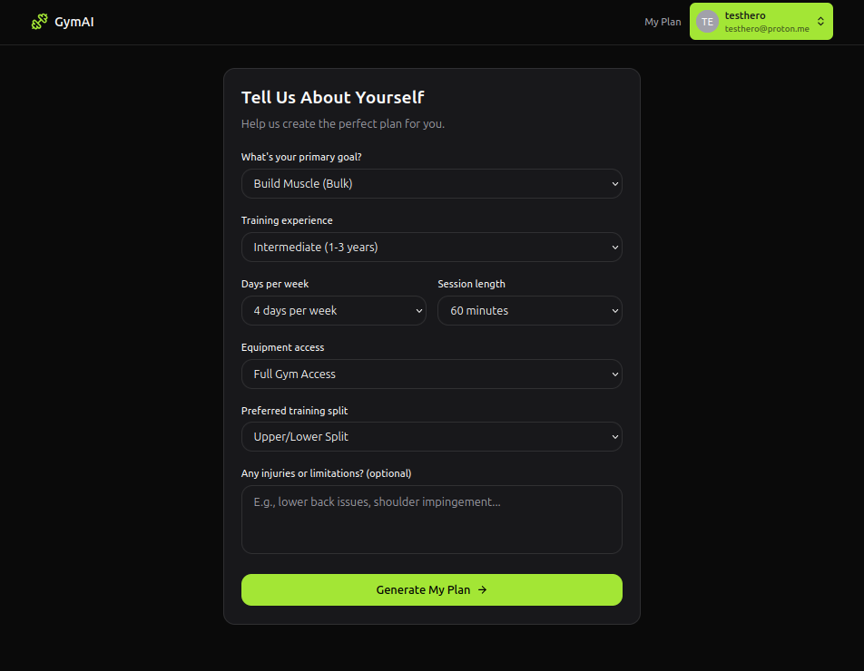
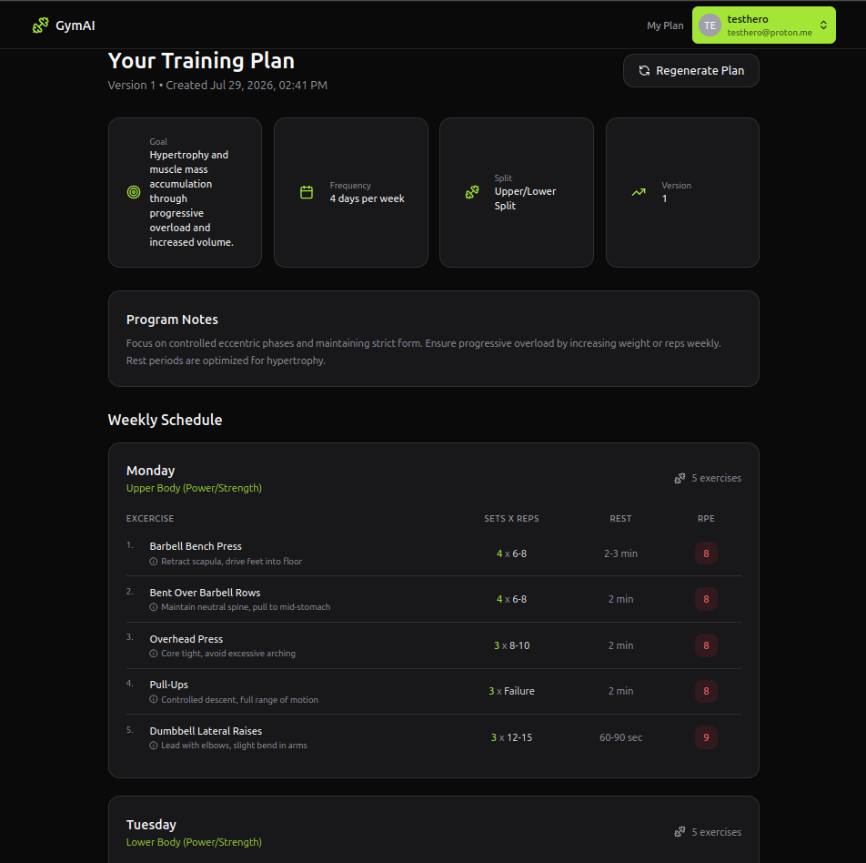

# Gym AI Planner

An AI-powered workout planning application built with React, TypeScript, Express, PostgreSQL, and OpenRouter.

Users complete a short onboarding questionnaire and receive a personalized training program generated by an AI model based on their fitness goals, experience level, equipment, and schedule.

---

## Screenshots

### Home Page


### Onboarding Questionnaire



### Generated Training Plan



---

## Features

- User authentication
- Personalized onboarding questionnaire
- AI-generated workout plans
- Workout schedule with exercises, sets, reps, rest, and RPE
- PostgreSQL database for user profiles and training plans
- Responsive React frontend
- Express REST API backend

---

## Tech Stack

### Frontend

- React
- TypeScript
- Vite

### Backend

- Express
- Node.js
- PostgreSQL

### Authentication

- Neon Auth

### AI

- OpenRouter API

---

## Project Structure

```
src/
    React frontend

server/
    Express backend
    API routes
    AI integration
    Database access
```

---

## Getting Started

### Install dependencies

```bash
npm install

cd server
npm install
```

### Environment Variables

Create the following files:

Frontend:

```
.env
```

Example:

```
VITE_NEON_AUTH_URL=your_neon_auth_url
```

Backend:

```
server/.env
```

Example:

```
DATABASE_URL=your_database_url
OPEN_ROUTER_KEY=your_openrouter_api_key
BASE_URL=http://localhost:3001
```

### Run the frontend

```bash
npm run dev
```

### Run the backend

```bash
cd server
npm run dev:server
```

---

## Future Improvements

- Deploy to production
- Connect custom domain
- Improve program generation
- Add exercise history and progress tracking

---

## Acknowledgements

This project began as a learning exercise following a tutorial by Pedro Machado and was subsequently configured, debugged, completed, version-controlled, and deployed as part of my full-stack web development learning journey.

---

## Author

GitHub: https://github.com/opexcel